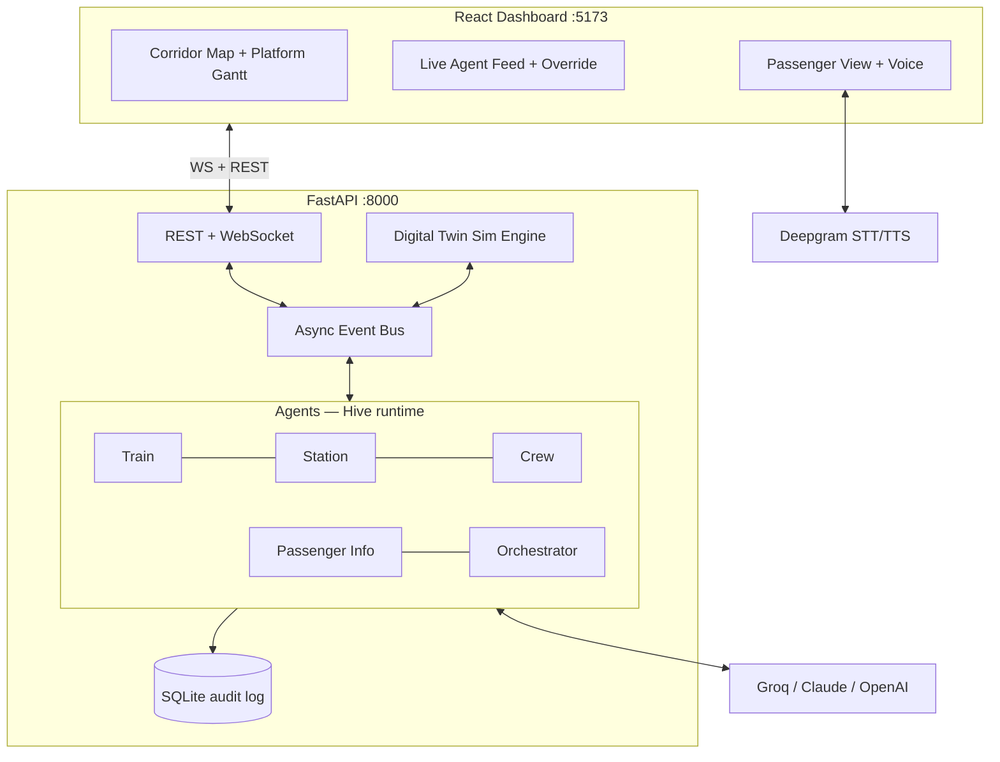

# RailMind — Agentic Operating System for Indian Railways

**A multi-agent control room for Indian Railways: autonomous Train, Station, Crew, and Passenger-Info agents negotiate over a live digital twin — detecting delays, reallocating platforms, swapping crews, and talking to passengers by voice — with every decision visible, overridable, and auditable.**

Built for **FAR AWAY 2026** (Zuup international youth hackathon) on [**Hive**](https://github.com/chiruu12/Hive), our own open-source agent framework.

---

## The problem

Indian Railways runs one of the largest, most complex rail networks on Earth — and it is buckling under its own scale:

- **19 million passengers daily** across a **69,000 km** network
- Punctuality has collapsed from **~94.2% (2020) to ~73.6% (2023)**
- **Over 80% of critical routes run beyond capacity** (22% above 150%), so a single delay cascades into platform clashes, crew duty violations, and stranded passengers

Today those cascades are untangled by hand: controllers on phones, station masters re-platforming ad hoc, crew planners reassigning rosters with limited situational awareness. Research on multi-agent dispatch suggests the headroom is enormous — junction-level multi-agent systems have shown **~34% throughput gains over naive dispatching** in published studies.

## What RailMind does

RailMind runs a live digital twin of the New Delhi → Kanpur → Prayagraj → Deen Dayal Upadhyaya (Mughalsarai) corridor — 4 stations, 8 trains with real numbers and names — and puts a team of AI agents in the control room:

1. An operator injects a disruption (e.g. *delay the Howrah Rajdhani by 25 minutes*) with one click.
2. The agent cascade fires **visibly, live, in the activity feed**: the Train Agent projects downstream impact → the Station Agent detects a platform conflict and negotiates a reassignment → the Crew Agent flags a duty-hour breach and proposes a swap → the Orchestrator reviews and approves → the Passenger Info Agent broadcasts alerts. Each step streams the agent's actual reasoning.
3. The corridor map and platform Gantt update in real time; the KPI panel shows knock-on delay avoided versus a naive no-agent baseline.
4. A passenger **speaks** to the system — "Where is train 12302?" — and gets a spoken answer grounded in live twin data (Deepgram STT/TTS).
5. The human operator can **reject any agent proposal**; the system recomputes, and everything lands in a persistent audit log.

## Architecture



The sim engine advances the twin (1 sim-minute per real second, adjustable), every event flows through an in-process async bus, and every bus event is mirrored to the UI over WebSocket and appended to the audit log.

## The safety principle: rules validate, LLMs decide

RailMind never lets a language model invent an operational action. The split is strict:

- **Deterministic core** — platform feasibility (no overlapping occupancy within a 5-minute headway buffer), crew duty math (max 9-hour duty, swaps only where a spare crew is based), and ETA projection are computed by plain rules over twin state. Guaranteed correct.
- **LLM layer** — agents choose *between* rule-validated candidate options, negotiate priorities, and explain their reasoning in plain language.
- **Human-in-the-loop** — the Orchestrator is the single approval point, the operator can override any proposal, and every decision (options considered, choice, rationale, resolution) is persisted to the audit log.

An infeasible assignment is structurally impossible, and if every LLM provider fails the agents degrade to rule-only mode with templated rationale — the control room keeps working.

## Quickstart

Prerequisites: Python 3.12+ with [uv](https://docs.astral.sh/uv/), Node with [pnpm](https://pnpm.io/).

```bash
git clone <this-repo> && cd ir-agent-os
cp .env.example backend/.env   # add API keys — or run keyless, see below
make dev                       # backend :8000 + frontend :5173
```

Open **http://localhost:5173** for the control room, **http://localhost:5173/passenger** for the passenger view.

**No API keys? Set `AGENT_LLM=off`** in `backend/.env` — agents run on the deterministic rules with templated rationale, and the full demo cascade still works end to end. With keys (`GROQ_API_KEY`, `ANTHROPIC_API_KEY`, `OPENAI_API_KEY`, `DEEPGRAM_API_KEY`), you get live LLM reasoning and the voice assistant.

Run the tests:

```bash
make test
```

## Demo scenario walkthrough

The seed timetable (sim day 2026-06-13, sim clock starts 08:00 IST) is engineered so one delay triggers a real multi-agent cascade:

1. **Inject** — from the scenario panel, delay **train 12302 (Howrah Rajdhani)** by **25 minutes**.
2. **Delay detection** — the Train Agent projects downstream impact: Kanpur Central (CNB) arrival slips 09:10 → 09:35, Prayagraj (PRYJ) 10:10 → 10:35, DDU 11:00 → 11:25.
3. **Platform conflict** — CNB's Station Agent spots the clash: 12302 now wants **platform 1 at 09:35**, exactly when **12560 (Shiv Ganga Express)** is booked there. Platform 2 is blocked by the terminating 12420 (Gomti Express) until 10:00 and platform 4 by the 64581 MEMU — so the rules offer **platform 3** as the feasible escape.
4. **Reassignment** — the Station Agent proposes moving 12302 to platform 3; the Orchestrator approves; the Gantt re-flows live.
5. **Duty breach** — the Crew Agent runs the math: crew **CR-101** started duty at 02:00 with a 9-hour limit (ends 11:00), and the projected 11:25 arrival at DDU breaches it.
6. **Crew swap** — spare crew **CR-201** is based at PRYJ, the last stop before the breach. The Crew Agent proposes the swap there; approved.
7. **Passenger alerts** — the Passenger Info Agent broadcasts the platform change and revised ETAs; banners appear in the passenger view, and you can ask the voice assistant "Where is train 12302?"

At any decision card you can hit **Reject** instead and watch the agents recompute — the override is recorded in the audit log at `GET /api/decisions`.

## Tech stack

| Layer | Choice |
|---|---|
| Agent framework | **[Hive](https://github.com/chiruu12/Hive)** (our own OSS project) behind a thin `AgentRuntime` adapter |
| LLMs | Groq (fast agent decisions) · Anthropic Claude (Orchestrator + passenger chat) · OpenAI (fallback) · rule-only mode (no keys) |
| Voice | Deepgram STT + Aura TTS |
| Backend | Python 3.12, FastAPI, Pydantic v2, asyncio pub/sub, SQLModel + SQLite (audit log), uv |
| Frontend | React 19, TypeScript, Vite, Tailwind CSS v4, Leaflet (OpenStreetMap) |
| Transport | REST + WebSocket (`/ws` streams every bus event) |
| Data | Fabricated demo timetable seeded with real train numbers/names + Datameet station coordinates |

## Screenshots

<!-- TODO(polish): add screenshots before submission -->
> *Coming with the final submission:*
>
> - [ ] Control room — corridor map, platform Gantt, live agent feed
> - [ ] Agent cascade mid-flight (conflict pulse + decision cards)
> - [ ] Human override on a decision card
> - [ ] Passenger view with voice query
> - [ ] KPI panel — agents vs baseline

## Roadmap

The MVP is one corridor and a simulated twin by design. The path to the real network:

1. **Pilot corridor** with real data feeds — NTES live running status, FOIS freight movements, crew rosters via COA — replacing the sim as the source of truth (the twin already treats data ingestion as a pluggable layer).
2. **Predictive layer** — swap rule-based ETA projection for ML delay prediction trained on historical running data; predictive maintenance agents on sensor/SCADA feeds.
3. **More agents** — freight coordination on Dedicated Freight Corridors, maintenance scheduling, emergency response protocols.
4. **Formal verification** of the deterministic safety rules, as done for CBTC-class signaling systems — the rules/LLM split was chosen precisely so the safety-critical core stays verifiable.
5. **Scale-out** — the in-process event bus swaps for Kafka/NATS, agents become horizontally scaled services, multi-corridor then zonal coverage.

## License

[MIT](./LICENSE)
