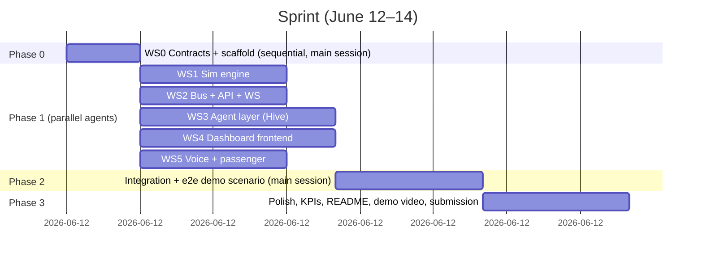

# Multi-Agent Build Plan

How we build [SPEC.md](./SPEC.md) with parallel, isolated coding agents in ~2 days. Each workstream (WS) is a self-contained brief: an agent can complete it with only the contract files and its own directory. Workstreams touch disjoint directories so worktree-isolated agents never conflict.

## Build phases

**Rule: Phase 0 is done by the main session, alone, before any agent spawns.** Contracts are the only files multiple workstreams read; they are frozen after Phase 0. Any contract change during Phase 1 goes through the main session and is broadcast to affected agents.

## Phase 0 — WS0: Contracts + scaffold (main session, ~2-3h)

Deliverables, in order:

1. Repo scaffold per SPEC §10: `backend/` (uv + FastAPI skeleton, runnable), `frontend/` (Vite + React + TS + Tailwind skeleton, runnable), `data/`, `scripts/`, root `Makefile` (`make dev`, `make backend`, `make frontend`, `make seed`).
2. `backend/app/contracts/entities.py` + `events.py` — every Pydantic model from SPEC §5–6, with docstrings and example payloads.
3. `backend/app/bus/bus.py` — the minimal asyncio pub/sub **interface** (publish/subscribe/topic typing) with an in-memory implementation good enough for every other WS to import. WS2 hardens it.
4. `frontend/src/api/types.ts` — TS mirrors of all contracts; `frontend/src/api/ws.ts` — WS hook stub.
5. `data/timetable.json`, `data/stations.csv`, `data/crews.json` — seed corridor: NDLS–CNB–PRYJ–MGS (real coords from Datameet), 8 trains with real numbers/names (e.g. 12952 Tejas Rajdhani style), 2 spare crews, schedules engineered so the demo delay creates exactly one platform conflict + one duty breach.
6. `docs/CONTRACTS.md` — one page: topics table, REST routes, "how to run against the mock bus" instructions for agents.
7. Fill in root `CLAUDE.md` (tech stack, commands, conventions) so every spawned agent inherits correct context.

## Phase 1 — Parallel workstreams

Spawn as worktree-isolated agents (or Conductor workspaces). Each brief below is the prompt skeleton.

### WS1 — Simulation engine (digital twin)
- **Owns:** `backend/app/sim/`, `scripts/seed.py`
- **Reads:** `contracts/`, `bus/`, `data/`
- **Build:** Network model loaded from seed data; tick loop (1 sim-min/sec, speed adjustable) advancing trains by schedule + delay; emits `train.position`/`train.status`; scenario application (`delay`, `platform_block`, `crew_sick`) via `scenario.injected`; applies `platform.reassigned`/`crew.swapped` back into twin state; deterministic ETA projection (`project_downstream_impact` helper used by agent tools); baseline mode (no agents — naive FIFO platforming) for the KPI comparison.
- **DoD:** pytest covering tick math, scenario application, conflict creation from the demo seed; runs standalone emitting events to bus with `python -m app.sim.run`.

### WS2 — Event bus hardening + REST/WS API
- **Owns:** `backend/app/bus/`, `backend/app/api/`, `backend/app/main.py`
- **Reads:** `contracts/`, sim/agent interfaces (stubs ok)
- **Build:** Bus: typed topics, audit sink to SQLite (`AgentDecision` + raw event log), replay-last-N for late WS subscribers. API: all routes from SPEC §8 except `/api/voice` (WS5); `WS /ws` fan-out of every bus event; CORS for :5173; graceful startup wiring (sim + agents registered via lifespan).
- **DoD:** OpenAPI docs render; `wscat` shows live events with sim running; audit rows persist across restart.

### WS3 — Agent layer (Hive)
- **Owns:** `backend/app/agents/`
- **Reads:** `contracts/`, `bus/`, sim helper signatures from CONTRACTS.md
- **Build:** `AgentRuntime` adapter wrapping Hive (constructor: persona/instructions, tools, model, structured output schema) — **all Hive imports live only in this file** (Agno escape hatch). Five agents per SPEC §7 with personas + deterministic tools; decision flow rules → feasible candidates → LLM choice + rationale; every agent emits `agent.thought` (streamed) and `decision.proposed`; Orchestrator approval flow incl. human override hook; cooldowns/idempotency (no oscillation); provider fallback chain Groq → Anthropic → OpenAI → rule-only templated rationale.
- **DoD:** Integration test with mock bus: feed `delay.detected` fixture → assert `platform.reassigned` + `crew.swapped` + audit entries, with real LLM calls behind an env flag (`AGENT_LLM=off` for CI-style runs).
- **Note:** First task = 30-min Hive spike (install, one agent, one tool, structured output). If blocked >2h total, switch adapter internals to Agno and report.

### WS4 — Control-room frontend
- **Owns:** `frontend/src/` (except `features/passenger/`)
- **Reads:** `frontend/src/api/types.ts`, CONTRACTS.md
- **Build:** WS hook with reconnect + event store (Zustand or context); Leaflet corridor map with moving train markers (color by status); platform Gantt per station (conflict pulse); Agent Feed right rail — streaming thoughts, decision cards with approve/reject (calls `/api/decisions/{id}/resolve`); KPI strip; scenario injector panel; sim controls. Dark "control room" aesthetic.
- **DoD:** Runs against a fixture WS server (`scripts/mock_ws.py` — agent writes this first from CONTRACTS.md examples) before backend integration; all views render with seed data.

### WS5 — Passenger experience: chat + voice
- **Owns:** `backend/app/api/voice.py`, `backend/app/agents/passenger_chat.py`, `frontend/src/features/passenger/`
- **Reads:** `contracts/`, types.ts
- **Build:** `/api/chat` (Claude with twin-state tools, session memory dict); `/api/voice` (Deepgram prerecorded STT → chat pipeline → Deepgram Aura TTS → audio URL); passenger view: mobile-frame page, my-train status card, alert banners from `passenger.alert`, chat with mic (MediaRecorder) + audio playback.
- **DoD:** curl round-trip for chat; browser mic round-trip for voice; alerts appear when WS events fire.

### WS6 — Pitch & submission pack (background agent, low priority)
- **Owns:** `README.md`, `docs/DEMO_SCRIPT.md`, `docs/PITCH.md`
- **Build:** README (problem, architecture diagram, quickstart, screenshots placeholder); demo script (exact click-by-click for §2 narrative + spoken talking points + KPI claims with sources from exec summary); pitch outline mapped to likely judging axes (innovation, technical depth, impact, completeness).

## Phase 2 — Integration (main session)

1. Merge order: WS2 → WS1 → WS3 → WS4 → WS5 (API surface first, then producers, then consumers).
2. Wire lifespan: seed → sim → agents → API; run full demo scenario; fix contract drift (main session owns `contracts/`).
3. End-to-end pass of SPEC §12 checklist; tune sim speed + schedule offsets so the cascade lands well-paced on screen (~60–90s).
4. `scripts/demo.py` — one command that resets, starts, and injects the scripted scenario.

## Phase 3 — Polish + submission

- Visual polish pass on control room (this is what screenshots/video show).
- KPI numbers verified against baseline mode.
- Record 2–3 min demo video (screen + voiceover per DEMO_SCRIPT.md).
- Final README, push, submit on Unstop before the deadline — **target submission by June 13 evening, keeping June 14 as buffer.**

## Coordination rules

- Contracts (`backend/app/contracts/`, `frontend/src/api/types.ts`, `docs/CONTRACTS.md`) are frozen after Phase 0; changes only via main session.
- Each WS agent commits to its own branch/worktree; main session merges.
- Agents must not edit files outside their **Owns** list.
- Anything blocked >30 min: stub it behind the contract interface, note it in the agent's final report, move on.
- Secrets: all keys via `.env` (gitignored), loaded with pydantic-settings; `.env.example` lists `GROQ_API_KEY`, `ANTHROPIC_API_KEY`, `OPENAI_API_KEY`, `DEEPGRAM_API_KEY`.
