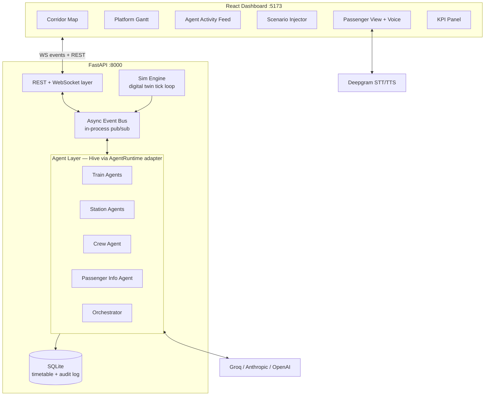

# IR Agent OS — Build Spec (Hackathon MVP)

**Product name:** Rail Saarthi — Agentic Operating System for Indian Railways
**Hackathon:** FAR AWAY 2026 (Zuup) — online build round, submission window ends ~June 14
**Today:** June 12 → **~2 build days. Every decision below is optimized for a working, demoable product, not production scale.**

Full background and long-term design: see [executive-summary.md](./executive-summary.md). This spec is the subset we actually build.

---

## 1. One-liner

A multi-agent control room for Indian Railways: autonomous Train, Station, Crew, and Passenger-Info agents negotiate over a live digital twin of a railway corridor — detecting delays, reallocating platforms, swapping crews, and talking to passengers (text + voice) in real time, with every agent decision visible and auditable on a live dashboard.

## 2. What the judges see (demo narrative)

1. Dashboard shows a live corridor map (4 stations, ~8 trains moving on schedule) + a station platform Gantt + an **agent activity feed**.
2. Operator injects a scenario: "Delay Train 12302 by 25 min" (one click).
3. The agent cascade fires visibly in the feed: Train Agent raises delay event → Station Agent detects platform conflict, negotiates reallocation → Crew Agent flags duty-hour breach, proposes swap → Orchestrator approves → Passenger Info Agent broadcasts alerts. Each step shows the agent's reasoning, streamed live.
4. The Gantt and map update; conflict resolved with zero human input. KPI panel shows knock-on delay avoided vs naive baseline.
5. Passenger view: user **speaks** "Where is train 12302? I have a connection at Kanpur" → Deepgram STT → agent answers with live twin data → TTS reply.
6. Human override: operator rejects an agent proposal; system recomputes. (Safety story: human-in-the-loop, full audit log.)

**The three wow factors, in priority order:** (1) visible live agent negotiation, (2) voice passenger assistant, (3) measurable KPI improvement vs baseline.

## 3. Key decisions (locked)

| Decision | Choice | Rationale |
|---|---|---|
| Agent framework | **Hive** (chiruu12/Hive), wrapped behind a thin `AgentRuntime` adapter | It's our own project — strong differentiation/story for judges; already supports Anthropic/OpenAI/Groq, tool decorators, structured Pydantic output, A2A patterns. Adapter keeps an **Agno escape hatch**: if Hive blocks integration for >2 hours, swap the adapter internals to Agno without touching agent logic. |
| LLM routing | **Groq** (llama-3.3-70b or similar) for high-frequency agent decisions; **Claude (Anthropic)** for Orchestrator reasoning + passenger chat; **OpenAI** as fallback provider | Groq = speed for the live cascade (sub-second agent turns on stage); Claude = best reasoning/explanations where quality is visible; fallback = demo resilience. |
| Voice | **Deepgram** STT + TTS (Aura) | We have the key; voice passenger assistant is a cheap, high-impact wow. |
| Backend | **Single FastAPI app** (Python 3.12+, uv): sim engine + event bus + agents + REST/WS in one process | No Kafka, no K8s, no microservices, no Neo4j/Timescale. In-process asyncio pub/sub is indistinguishable in a demo and removes all infra risk. |
| Persistence | **SQLite** (via SQLModel) for timetable/audit log; in-memory state for live twin | Zero setup; audit log survives restarts for the "traceability" story. |
| Frontend | **React + TypeScript + Vite + Tailwind**, Leaflet (OSM) for map, WebSocket live updates | Team's known stack; fast. |
| Intelligence split | **Deterministic core, LLM narration/negotiation layer** | Feasibility (platform conflicts, headway, crew duty math) is computed by rules/heuristics — guaranteed correct on stage. LLMs decide *between* feasible options and explain why. The demo can never produce an infeasible assignment because the LLM only picks from rule-validated candidates. |
| Scale | 1 corridor (New Delhi–Kanpur–Prayagraj–DDU), 4 stations, ~8 trains, 1 spare crew pool | Small enough to seed by hand, big enough to manufacture conflicts. |
| Data | Fabricated timetable JSON seeded from real train numbers/names + Datameet stations.csv for coords | No live NTES scraping in MVP — sim is the source of truth. Real station coords make the map look legit. |

## 4. System architecture



- **Sim engine** advances the twin on a tick (1 sim-minute per real second, configurable). It moves trains along the corridor, emits `train.position` and `train.status` events, and applies injected scenarios.
- **Event bus** is an asyncio pub/sub with typed topics. Every published event is also forwarded to the WS layer (UI) and appended to the audit log.
- **Agents** subscribe to topics, run their decision loop (rules → candidate options → LLM choice/explanation), and publish decision events.
- **Frontend** holds no business logic; it renders the event stream + REST snapshots.

## 5. Domain model

| Entity | Key fields |
|---|---|
| `Station` | code, name, lat, lon, platform_count |
| `Train` | number, name, priority (1=premium..3=local), route: list[StationStop], status, delay_min, position (km offset) |
| `StationStop` | station_code, sched_arrival, sched_departure, platform |
| `Crew` | id, name, assigned_train, duty_start, max_duty_hours, status (on_duty/spare) |
| `PlatformAssignment` | station_code, platform, train_number, arrival, departure |
| `AgentDecision` (audit) | id, ts, agent, event_trigger, options_considered, chosen, rationale, status (proposed/approved/rejected/auto) |

## 6. Event bus topics (the core contract)

All events are Pydantic models in `backend/app/contracts/events.py` — **this file is the inter-workstream contract; it is written first and changes require updating `docs/CONTRACTS.md`.**

| Topic | Payload (summary) | Publisher → Subscribers |
|---|---|---|
| `train.position` | train_number, lat/lon, km_offset, speed | Sim → UI |
| `train.status` | train_number, status, delay_min, next_station, eta | Sim → Train Agent, UI |
| `delay.detected` | train_number, delay_min, cause, downstream_stops | Train Agent → Station Agents, Crew Agent, Orchestrator, UI |
| `platform.conflict` | station_code, trains involved, overlap window | Station Agent → Orchestrator, UI |
| `platform.reassigned` | station_code, train_number, old/new platform, rationale | Station Agent → Sim, Passenger Agent, UI |
| `crew.duty_breach` | crew_id, train_number, projected_hours, limit | Crew Agent → Orchestrator, UI |
| `crew.swapped` | old_crew, new_crew, train_number, station, rationale | Crew Agent → Sim, UI |
| `passenger.alert` | severity, train_number, message, channels | Passenger Agent → UI |
| `agent.thought` | agent, text, decision_id | All agents → UI (the live feed) |
| `decision.proposed` / `decision.resolved` | AgentDecision payload | Agents/Orchestrator → UI, audit |
| `scenario.injected` | type (delay/platform_block/crew_sick), params | API → Sim |

## 7. Agents

Each agent = Hive agent with persona + tools, behind `AgentRuntime`. Tools are plain Python functions over twin state (deterministic), so agents stay correct.

| Agent | Trigger | Tools | Model |
|---|---|---|---|
| **Train Agent** (one per train, lightweight) | `train.status` with growing delay | `get_schedule`, `project_downstream_impact`, `publish_delay` | Groq |
| **Station Agent** (one per station) | `delay.detected`, `platform.conflict` | `get_platform_board`, `find_feasible_platforms` (rule-validated candidates), `reassign_platform` | Groq |
| **Crew Agent** (singleton) | `delay.detected` | `get_crew_roster`, `check_duty_rules` (deterministic math), `find_spare_crews`, `propose_swap` | Groq |
| **Passenger Info Agent** | `platform.reassigned`, `crew.swapped`, `delay.detected`; chat/voice queries | `get_train_status`, `get_station_board`, `compose_alert` | Claude (user-facing quality) |
| **Orchestrator** | `decision.proposed`, conflicts between agents | `get_network_snapshot`, `approve/reject`, `compute_kpi_delta` | Claude (visible reasoning) |

Duty rules for MVP: max 9h duty; swap allowed only at a station with a spare crew. Platform feasibility: no overlapping occupancy within a 5-min headway buffer.

## 8. REST + WS API

- `GET /api/state` — full twin snapshot (trains, stations, assignments, crews, KPIs)
- `GET /api/trains/{number}` — train detail + history
- `GET /api/decisions` — audit log (filterable)
- `POST /api/scenarios` — inject `{type: "delay"|"platform_block"|"crew_sick", ...params}`
- `POST /api/decisions/{id}/resolve` — human approve/reject
- `POST /api/chat` — passenger chat `{message, session_id}` → `{reply}`
- `POST /api/voice` — audio in (webm/wav) → Deepgram STT → agent → `{reply_text, reply_audio_b64, reply_audio_mime}`
- `WS /ws` — all bus events, JSON-serialized `{topic, payload, ts}`
- `POST /api/sim/{start|pause|reset}` + `POST /api/sim/speed`

## 9. Frontend views

1. **Control Room (main):** Leaflet corridor map (train markers, color = status) · Platform Gantt per station (rows = platforms, blocks = trains; conflict blocks pulse red) · **Agent Feed** (right rail: streaming `agent.thought` + decision cards with approve/reject buttons) · KPI strip (total delay-min, knock-on delays avoided, % instant platforming, decisions made).
2. **Scenario panel:** buttons/forms for the 3 scenario types + sim speed control.
3. **Passenger view** (separate route, mobile-frame styling): live status of "my train", alert banners, chat box with mic button (voice round-trip).

## 10. Repo layout (this repo)

```
ir-agent-os/
├── docs/                      # this spec, exec summary, contracts, agent plan, demo script
├── backend/
│   ├── pyproject.toml         # uv-managed
│   └── app/
│       ├── contracts/         # events.py, entities.py  ← WS0, frozen first
│       ├── sim/               # twin: network, tick loop, scenarios
│       ├── bus/               # async pub/sub + audit sink
│       ├── agents/            # runtime adapter, personas, tools, each agent
│       ├── api/               # REST routes, ws, voice (deepgram)
│       └── main.py
├── frontend/                  # Vite + React + TS + Tailwind
│   └── src/
│       ├── api/               # typed client + WS hook
│       ├── features/control-room/
│       ├── features/scenario/
│       └── features/passenger/
├── data/                      # timetable.json, stations.csv, crews.json
└── scripts/                   # seed, demo-scenario runner
```

## 11. Out of scope (explicitly cut for MVP)

Freight/FOIS, maintenance/SCADA agents, ML delay prediction (rule-based ETA projection instead — the spoken story is "pluggable predictor"), real NTES/IRCTC integration, RL, Kafka/K8s, auth, mobile app, multi-corridor. All of these stay in the pitch as the roadmap (exec summary §15).

## 12. Success criteria (definition of done for submission)

- [ ] `make dev` (or two commands) brings up backend + frontend locally from a clean clone
- [ ] Demo scenario from §2 runs end-to-end reliably 3× in a row
- [ ] Agent feed shows real LLM reasoning streamed live (not canned strings)
- [ ] Voice round-trip works (mic → STT → answer → TTS audio)
- [ ] Human override works and is recorded in audit log
- [ ] KPI panel shows baseline-vs-agent comparison for the demo scenario
- [ ] README with architecture diagram, setup, demo script; 2–3 min demo video recorded
- [ ] Graceful degradation: if any LLM provider fails, agents fall back to next provider, then to rule-only mode with templated rationale (demo never dies on stage)

## 13. Risks

| Risk | Mitigation |
|---|---|
| Hive SDK friction under deadline | `AgentRuntime` adapter; Agno swap is a contained, pre-scoped fallback |
| LLM latency kills live demo | Groq for hot path; stream thoughts so latency reads as "thinking"; rule-only fallback |
| Sim/agent feedback loops (oscillating reassignments) | Decisions are idempotent + cooldown per train/station; orchestrator is single approval point |
| Integration crunch | Contracts frozen first (WS0); all workstreams build against `contracts/` + mock bus fixtures |
| Demo-day flakiness | Scripted scenario runner (`scripts/demo.py`) + recorded video as backup |
