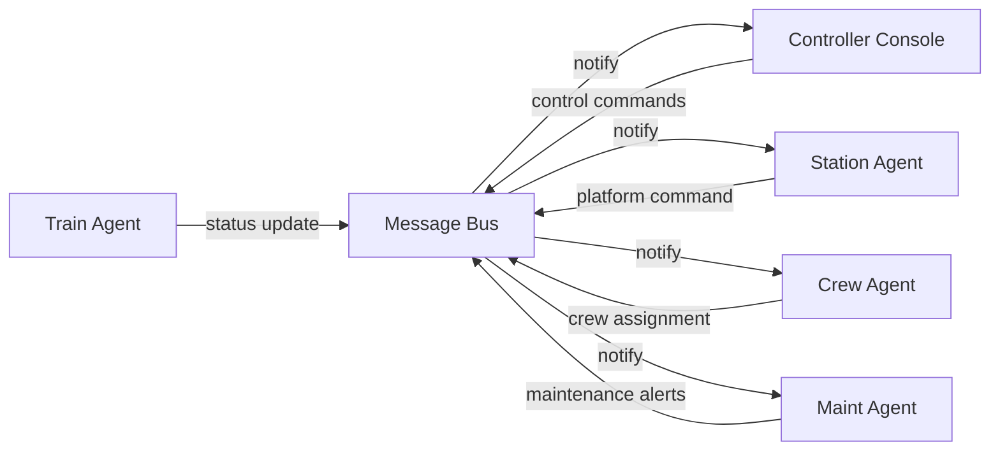

# Agentic Operating System for Indian Railways: Executive Summary

> Markdown transform of `Agentic Operating System for Indian Railways_ Executive Summary.pdf` (15 pages). Citation markers from the original research report have been removed for readability.

This report presents a comprehensive design and development plan for an **Agent-based Operating System (OS)** tailored to the Indian Railways (IR). Indian Railways is one of the world's largest and most complex railway networks, carrying about **19 million passengers daily** across a **69,000 km** network. Despite modernization efforts (e.g. new train services, track expansion), IR grapples with chronic delays, congestion, and safety concerns. The punctuality index has fallen sharply (from ~94.2% in 2020 to ~73.6% in 2023), largely due to aging infrastructure, capacity overload (80% of key routes exceed capacity), diesel locomotive failures, signaling faults, and maintenance backlogs. In response, IR has begun adopting advanced digital technologies (Unified IP-MPLS networks at 1,396 stations, AI video analytics for security, integration of passenger information with NTES at 1,405 stations).

An **Agent OS** leverages multi-agent systems and AI to orchestrate railway operations across this scale. By decentralizing control into autonomous software agents (train agents, station agents, crew agents, etc.), the system can coordinate scheduling, routing, and resource allocation in real time. Agents exchange information over a central communications backbone (e.g. message bus) to react to disturbances (e.g. train delays) and optimize overall flow. Prior work (e.g. Verma & Pattanaik 2015) shows that multi-agent architectures suit distributed, safety-critical rail control. Recent research demonstrates that such systems (e.g. junction-level MAS with collaborative voting) can increase network throughput by ~34% over naive dispatching. Simulation case studies (e.g. Netherlands Railways) use agent-based models to optimize crew and timetable, identifying delay-prone corridors.

Our Agent OS aims to mitigate IR's key pain points (delays, platform conflicts, crew/maintenance scheduling) by enabling **real-time monitoring, predictive analytics, and autonomous decision-making**. Leveraging official data sources (NTES train status, Freight Operations Info System, IRCTC bookings, satellite/GPS feeds, IoT sensors) and advanced algorithms (ML for delay prediction, optimization/OR for scheduling, reinforcement learning for adaptive control), the system will present an intuitive control dashboard and passenger interface. A 3–4 day hackathon MVP will focus on core use-cases (e.g. dynamic delay recovery and platform re-assignment), with a clear roadmap, metrics, and demonstrations.

## 1. Problem Statement: Pain Points in Indian Railways Operations

Indian Railways faces multiple operational challenges that motivate an agentic solution:

- **Chronic Delays and Congestion:** Punctuality has declined significantly (punctuality index ~73.6% in 2023 vs ~94.2% in 2020). Over 80% of critical routes exceed capacity, with 22% running at >150% capacity. Trains often await platform clearance or are held due to downstream bottlenecks. Diesel locomotive failures (≈5 incidents/day) can halt trains mid-route, blocking lines. The gridlock of shared tracks (passenger vs freight) exacerbates knock-on delays.
- **Fragmented Scheduling and Resource Allocation:** Timetabling, crew rosters, and maintenance windows are planned separately. Last-minute adjustments (rescheduling, platform changes) are ad-hoc and laborious. For example, crews must be reassigned manually when trains run late, often with limited situational awareness. Manual platform allocation leads to suboptimal usage at busy stations.
- **Outdated Infrastructure Constraints:** Much of IR uses legacy signaling (static block) that limits throughput. Track conditions, overhead line failures, and outdated rolling stock further reduce reliability. As noted by analysts, IR still relies on largely British-era infrastructure, with insufficient new track additions.
- **Complex, Safety-Critical Environment:** Multiple stakeholders (regional control offices, station masters, train crews) must coordinate under high-stakes conditions. Any fault (e.g. signaling or collision risk) has safety implications, so solutions must be fail-safe and transparent.
- **Limited Passenger Information:** Passengers currently rely on NTES/IRCTC apps for delays and PNR status. However, proactive alerts (e.g. rerouting advice, train attachments) and personalized info are minimal.
- **Freight Logistics Pressure:** IR handles ~1 billion tonnes of freight (2025-26) and aims to reach 3,000 MT by 2029-30. Dedicated Freight Corridors (DFCs) carry 400+ trains/day, but coordinating freight on DFCs vs legacy network remains complex.

Together, these issues constrain efficiency and passenger satisfaction. An agentic system can **proactively mitigate delays** (by forecasting and re-routing), **optimize platform and crew allocation**, and **coordinate maintenance and safety responses** across scales.

## 2. Target Users and Stakeholders

The Agent OS serves multiple stakeholder groups:

- **Station Masters and Staff:** They oversee operations at individual stations (platform assignments, local dispatch). Agents can assist by automatically allocating platforms to incoming trains based on status and priority, and alerting staff to late arrivals or maintenance needs.
- **Divisional/Zonal Control Centers:** Controllers manage train traffic regionally. They require a consolidated view of train movements. Agent-assisted global scheduling (e.g. re-sequencing trains at junctions) can help balance loads. A "Control Agent" could simulate corridor flows and recommend timetable adjustments.
- **Train Crew Planners:** Schedulers assign drivers and guards to train duties. A Crew Agent can optimize rosters (respecting duty laws) and adapt in real time when trains are delayed. For example, if a driver's shift is interrupted, the agent could reassign an alternate crew.
- **Maintenance and Infrastructure Teams:** These teams schedule track, signal, and rolling-stock maintenance. A Maintenance Agent can predict likely failures (via ML on sensor data), schedule preventive work during low-traffic windows, and swiftly re-route traffic when incidents occur.
- **Passengers:** Via mobile/web apps or station displays, passengers are indirect beneficiaries. A Passenger Information Agent can push live updates (delays, platform changes), personalized advisories (alternative trains, connecting services), and chat-based query support (e.g. via a chatbot) using NTES/IRCTC data. Enhanced feedback (crowdsourced delay reports) could also improve system visibility.
- **Freight Logistics Coordinators:** Freight agents interact with FOIS data and DFC schedules to optimize cargo routing. They handle wagon allotment, terminal transfers, and last-mile deliveries (e.g. first freight train to Anantnag).
- **Policymakers and Administrators:** Higher-level planners (Railway Board, Ministry) set policies on capacity expansion and safety. Insights from the Agent OS (e.g. where delays concentrate, maintenance ROI) inform infrastructure investment and policy.

### Agent Types and Stakeholders

| Agent Type | Primary Role | Stakeholder |
|---|---|---|
| **Train Agent** | Track train schedule, report status, request resources | Control Center, Crew Planner |
| **Station Agent** | Manage platform assignments, handle local conflicts | Station Master, Passengers |
| **Crew Agent** | Schedule crews, manage duty shifts and breaks | Crew Planners, Unions |
| **Maintenance Agent** | Predict and schedule maintenance; manage incidents | Maintenance Teams, CCOA |
| **Passenger Info Agent** | Provide real-time updates, answer queries (chatbot) | Passengers, Station Info Staff |
| **Freight Agent** | Coordinate freight train routing and cargo tracking | Freight Planners, Industries |
| **Supervisor/Orchestrator** | Global coordination, conflict resolution, analytics | Railway Admin, Policymakers |

## 3. Scope and Use-Cases

The Agent OS covers end-to-end railway operations. Key use-cases include:

- **Delay Detection and Mitigation:** *Example:* A Train Agent detects its schedule slipping (via NTES feed). It notifies the Station Agent and Control Agent. The Station Agent frees up an alternative platform if needed. The Control Agent recomputes downstream schedules (similar to multi-agent rescheduling in large networks). Crew and Passenger Agents are alerted. This closed-loop preserves network flow.
- **Dynamic Platform Allocation:** At busy junctions, Station Agents use real-time data to assign arriving/departing trains to the most suitable platforms, minimizing wait-time and conflicts. For instance, if two late trains approach, agents can execute a rapid negotiation to reorder them based on priority (intercity vs local).
- **Crew Scheduling and Dispatch:** A Crew Agent processes master rosters and incoming delay alerts. If a train is delayed beyond a crew's duty, the agent automatically reassigns a fresh crew or extends schedules legally (complying with labor rules). This reduces manual crew swaps and operational risk.
- **Maintenance Planning and Incident Response:** A Maintenance Agent aggregates sensor/SCADA data (e.g. track vibration, signal health) and predicts failures via AI models. It schedules preventive maintenance during slack periods. In case of a fault (e.g. track section alarm), it rapidly reroutes trains and notifies staff. Coordination with CCOA (Control Office Automation) systems ensures that maintenance work is communicated railway-wide.
- **Passenger Communication and Assistance:** A Passenger Info Agent pushes notifications through mobile apps or station displays (leveraging the Integrated Passenger Information System). For example, if a train's arrival platform changes, an automatic announcement is made (as currently integrated with NTES). Additionally, a conversational interface (AI chatbot) could answer passenger queries about PNR status, platform numbers, or suggest alternate routes.
- **Freight Coordination:** A Freight Agent monitors FOIS and DFC feeds to manage freight train scheduling. It might dynamically reroute freight trains via DFC to decongest passenger lines (as per Gati Shakti cargo planning). It also tracks cargo manifests and ensures timely transshipment at terminals (e.g. new freight hubs, export routes).
- **Emergency Response:** In case of accidents or natural disasters, a dedicated Emergency Agent can activate contingency protocols: halt incoming traffic, notify all agents to stop and secure trains, and coordinate with authorities via a pre-defined communication channel. The agent system's rapid event propagation ensures a faster, organized response.

This scope spans **timetabling, traffic control, and user-facing services**, embodying a holistic agentic railway control framework.

## 4. Functional Requirements

Key functional capabilities of the Agent OS include:

- **Real-Time Data Ingestion:** Continuously gather train positions/status (e.g. NTES train-on-map, GPS if available), schedule updates, crew rosters, sensor data (track signals, weather), and external inputs (emergency alerts).
- **Multi-Agent Coordination:** Support a collection of autonomous agents (as listed) that communicate via an internal protocol. Agents must implement negotiation and consensus (e.g., iterative slot negotiation, priority assignment).
- **Decision Support and Automation:** Agents should execute algorithms to optimize schedules, assign resources (platforms, crews), and reroute trains. They produce actionable plans (e.g. "Train 123 should use Platform 5 and depart 3 min late").
- **User Interface & APIs:** Provide a control dashboard (for controllers and station masters) showing maps, schedules, alerts, and allowing override commands. Provide passenger-facing APIs or widgets (e.g. web/mobile apps) for live updates. Also offer programmatic APIs (e.g. REST) for integration with existing IR apps.
- **Simulation/Digital Twin Mode:** A mode to run "what-if" scenarios using a railway network model (e.g. simulate a train delay or new timetable).
- **Logging and Audit:** Record decisions and communications for analysis. Ensure traceability of agent actions (critical for safety review).
- **Integration with Legacy Systems:** Interoperate with existing IR software (Control Office Automation, NTES, FOIS, SCADA). Agents may need to interface via available network links or mock systems.

### Functional Requirement Table (excerpt)

| Requirement | Description |
|---|---|
| Real-time train tracking | Fetch live train-running status (delay/on-time), positions (NTES/API). |
| Dynamic scheduling | Recompute train paths and platform assignments on disturbances. |
| Crew rostering | Generate and adjust driver/guard schedules respecting work rules. |
| Fault detection | Monitor sensor/IoT inputs to detect equipment issues; schedule maintenance. |
| Passenger alerts | Disseminate train alerts (delay notices, platform changes) via apps/displays. |
| Freight optimization | Plan cargo train dispatch on DFC vs mainline; ensure wagons availability. |
| Agent communication | Publish/subscribe framework (events, commands) for agent messaging. |
| Reporting | Generate analytics (delay statistics, resource utilization) for management. |

## 5. Non-Functional Requirements

- **Scalability:** Must handle IR scale (≈12,000 trains, 7,500 stations). The architecture should support thousands of agents and messages per second. Use horizontal scaling (microservices, cloud deployment).
- **Low Latency:** Safety-critical decisions require timely response. Key agent communications (e.g. delay alert, platform reassign) should occur within ~100 ms end-to-end.
- **Reliability & Availability:** Target "five 9s" uptime for central services. Agents should be fault-tolerant (e.g. state replication). Fall-back strategies if an agent/controller fails (e.g. reverting to manual procedures). Data stores must persist critical logs.
- **Security:** Secure data (encryption in transit/storage). Authenticate users and agents (certificates). Follow Railway IT guidelines (e.g. CBI security). Prevent malicious commands or false data injection (especially important for passenger info).
- **Privacy/Compliance:** Handle passenger PII (names, PNR) per Indian law. No unauthorized use of personal travel data.
- **Interoperability:** Interfaces should use standard protocols (REST/JSON, MQTT). Agents should be loosely coupled to allow components to be updated independently.
- **Maintainability:** Clear modular design (agents by function). Code and config management for evolving rules (e.g. labor laws change, new train types).
- **Resource Efficiency:** Use lightweight agent runtimes; possibly use edge computing (trackside devices) for local processing to reduce central load.
- **Robustness to Data Gaps:** The system must cope when some data feeds fail (e.g. NTES outage) by using recent data or safe defaults.
- **Evaluation & Monitoring:** Built-in metrics (latency, throughput, prediction accuracy) to continuously evaluate system health.

## 6. System Architecture

The architecture is a **distributed multi-agent system** composed of:

- **Agent Components:** Autonomous agents of different types (see Section 2). Each agent is a microservice (e.g. Docker/Pod in Kubernetes) with a narrow responsibility.
- **Supervisor/Orchestrator:** A central coordinating service (optional) that can handle global tasks (e.g. policy enforcement, high-level analytics, or orchestrating multi-agent negotiations). This is not a single point of failure but a weakly coupled manager.
- **Message Bus:** A high-throughput pub/sub system (e.g. Apache Kafka, NATS, or MQTT) forms the backbone. Agents publish events (e.g. "Train 101 delayed 10min") and subscribe to relevant topics (e.g. platform availability, crew availability). This decouples agents and ensures scalability.
- **Databases/Stores:** Shared data storage:
  - **Time-series DB** (e.g. InfluxDB/Timescale) for continuous data like sensor feeds.
  - **Relational DB** (PostgreSQL) for static schedules, roster data.
  - **Graph DB** (Neo4j) for network topology (stations, tracks).
  - **Cache** (Redis) for hot state (current locations, agent session data).
- **API Layer:** REST/gRPC endpoints for external interfacing (e.g. dashboard UI, IR legacy systems). This includes authentication, request validation, and routing to internal agents.
- **UI/Visualization:** Frontend (web/mobile) displaying maps (using Mapbox or OpenStreetMap), train boards, and dashboards. These call backend APIs.

### Agent Interaction Diagram (simplified)



Each agent publishes and subscribes to the central bus. For example, a Train Agent publishes a delay event; Station and Crew Agents subscribe to that topic to react.

**Data Flow:** External feeds (NTES, IRCTC API, weather API) feed into an ETL layer that writes to the Message Bus and databases. Agents consume these, compute, and output decisions/events back to the bus. The UI queries either agent APIs or subscribes to bus updates (via WebSockets) for live display.

**Scenarios:** In a delay event, the Train Agent sends an event with train ID and new ETA. The Station Agent(s) checks platform schedules and replies if a platform change is needed. Simultaneously, the Crew Agent examines the delay vs crew duty and posts a crew-reassignment task if needed. All communications occur via the bus, ensuring decoupling.

## 7. Data Sources and APIs

Potential data inputs for the Agent OS include:

- **National Train Enquiry System (NTES):** Provides live running status (estimated arrival/departure, delays) and general timetable info. Although no public API is documented, a **scraper or unofficial API** can fetch `NTES?action=getTrainData` or the live map endpoint. CRIS (Centre for Railway Info Systems) uses this internally.
- **Passenger Reservation & Ticketing (PRS/UTS/IRCTC):** Booking data (PNR status, occupancy counts). CRIS offers open PNR status API for integration. This informs passenger loads and can trigger alerts for overbooked trains.
- **Freight Operations Info System (FOIS):** Details on rake movements, freight bookings. Though IR provides FOIS to freight users, it's not publicly open. We assume read access via partnership or aggregated reports. This allows the Freight Agent to know wagon positions and cargo types.
- **Control Office Automation (COA)/CIMS:** Train dispatch and coach info systems for crew and coach tracking. These internal systems (CRIS-built) feed train schedules and coach composition. Access might be via a data dump or limited API.
- **Schedule & Timetable Data:** Static schedules (rake routes, station stops, week-of-day info). IR publishes revised time tables (text/PDF). Community datasets (e.g. Datameet's `schedules.json`, Kaggle's "Trains between stations") can seed schedule info.
- **Station Metadata:** Coordinates, zone, platform count. Datameet's stations.csv (open data) provides station codes with lat-lon.
- **GIS/Map Data:** Track layouts, electrification, geography. OpenStreetMap and OpenRailwayMap provide tracks and station maps. Useful for distance and connectivity modeling.
- **SCADA/IoT Sensors:** Signals, track circuits, locomotive health monitors. Modern IR includes SCADA for traction distribution and TMCS (Traction/Machine). These can feed alerts (e.g. signal malfunction, track buckling). An edge agent can collect this data.
- **Weather and External Feeds:** IMD or OpenWeather APIs for local conditions affecting operations (e.g. storms delaying trains).
- **Public APIs:**
  - **RailRadar.in:** (Unofficial) free Indian Railways data API, provides train status, schedules (via web scraping). Could be used for MVP, though official licensing must be checked.
  - **IRCTC PNR API:** Official PNR query API (free) for passenger counts.
  - **NTES and IR Mobile Apps:** Some third-party libraries (ntes-client PyPI) show ways to access NTES.
  - **Open Government Data:** Data.gov.in has some railway statics (gauge maps, accident stats) which may help scenario building (though not real-time).

### Data Source Table (excerpt)

| Type | Source | Data Provided | Access Method |
|---|---|---|---|
| Train Status/Timetables | NTES (CRIS) | Live train running status, delay stats | Web API or scrapers |
| Booking/PNR Info | IRCTC/PRS/UTS | PNR status, reserved tickets, passenger info | IRCTC PNR API (govt open) |
| Freight Movements | FOIS (Freight Op Info System) | Rake/train movement, cargo details | FOIS UI or DB export |
| Crew & Coach Data | CIMS/COA (Coach/Crew Mgmt Systems) | Coach composition, crew rosters | Internal data feeds |
| GIS/Station Meta | Datameet, OSM | Station codes, coords, network topology | Open datasets |
| Sensor Data | SCADA, TMCS, IoT (cameras, etc.) | Track/Sig health, video analytics alerts (intrusion) | Direct SCADA links |
| Weather | IMD API, OpenWeatherMap | Weather conditions impacting routes | Public weather APIs |

## 8. Models and Algorithms

The core intelligence of the Agent OS rests on data-driven models and optimization algorithms:

- **Delay Prediction:** Historical data (NTES delays, weather, maintenance schedules) feed ML models (e.g. LSTM networks or regression ensembles) to **predict delays** on upcoming runs. For example, given current delay, weather, and route congestion, the model forecasts arrival deviations. Similar predictive maintenance models (fault vs no-fault) can be built for assets.
- **Platform and Track Allocation:** This is a **constraint optimization** problem. Methods like bipartite matching or greedy heuristics can assign platforms to trains arriving in a time window, maximizing throughput and minimizing overlaps. An agent may use Integer Linear Programming (ILP) under the hood, subject to platform counts and headway constraints. Multi-agent negotiation protocols (e.g. Contract Net) can be applied: each Station Agent "bids" for a train, and a supervisor agent awards the platform.
- **Crew Scheduling:** Classic **crew rostering** can be solved by an OR solver (Mixed-Integer Programming or heuristics) respecting duty regulations. Agents can implement known algorithms (e.g. bidirectional heuristic, genetic algorithms) to generate schedules. For real-time adjustments, a greedy reallocation may suffice (e.g. swap crews between trains).
- **Rescheduling with Multi-Agent System:** The MDPI study proposes decomposing the network into junction-level agents using Condorcet voting among choices. We can adopt a similar decentralization: **Junction Agents** at major intersections negotiate train order when conflicts occur, ensuring globally feasible solutions. This cuts complexity for large networks.
- **Reinforcement Learning (RL):** RL can complement static optimization. For instance, an RL agent could learn to dispatch trains in simulation to minimize average delay (similar to multi-armed bandit or Q-learning approaches in traffic control). However, given the safety-critical context, any RL suggestions would require verification (perhaps run in simulation before real deployment).
- **Simulation/Digital Twin:** Implement a discrete-event **digital twin** of a segment of the network (stations, tracks, trains) to test agent decisions. Tools like AnyLogic (railway library) can simulate agent policies. As AnyLogic's case study showed, agents (representing trains/crew) can be embedded in simulation to evaluate scenarios (e.g. varying buffer times between trains).
- **Data Analytics:** Apart from real-time control, offline analytics (delay heatmaps, bottleneck identification) are needed. Techniques include network flow analysis and clustering of delay causes.

In summary, the Agent OS uses a combination of rule-based logic (for safety constraints), optimization (for scheduling/assignment), and learning-based prediction. All models should be trainable on Indian Railways data (timetables, historical running data from portals or scraped feeds).

## 9. Technology Stack and Infrastructure

- **Backend & Agents:**
  - *Language:* Python (for ML and quick agent prototyping) and/or Go/Java (for high-performance messaging). Python offers libraries (TensorFlow/PyTorch, pandas) and agent frameworks (e.g. SPADE, Ray RLlib) if needed.
  - *Agent Framework:* A lightweight microservice per agent (possibly running Flask/FastAPI or gRPC). Agents communicate via the message bus.
  - *Message Broker:* Apache Kafka or NATS Streaming for high-throughput, durable pub/sub. Kafka is industrial-grade (used by large-scale systems), while NATS is lightweight (suitable for edge).
  - *Databases:* PostgreSQL for core relational data (schedules, crew rosters), TimescaleDB (Postgres extension) for time-series (train positions, sensor logs), Redis or Memcached for caches, Neo4j for network graphs if needed.
  - *Middleware:* An API gateway (Kong or Nginx) for external API routing.
  - *Deployment:* Containerized with Docker, orchestrated via Kubernetes (for scalability across cloud or on-premises servers).
- **Machine Learning:**
  - *Framework:* PyTorch or TensorFlow for building predictive models.
  - *Serving:* TorchServe or TensorFlow Serving for online inference of models (delay predictions, etc.).
  - *Data Platform:* Spark or Dask for large-scale data processing if historical data is huge.
- **Frontend & Visualization:**
  - *Dashboard:* React or Angular web app for controllers, displaying train maps (Leaflet.js or Mapbox GL) with live updates.
  - *Mobile:* Optionally, a cross-platform app (React Native or web view) for passenger notifications.
  - *Mapping:* Mapbox or OpenLayers for track maps; Chart.js or D3.js for statistical charts.
  - *Chatbot:* A conversational AI interface (e.g. Rasa or ChatGPT integration via OpenAI API) to answer passenger queries using IR data.
- **Messaging & Notifications:**
  - Use WebSockets or MQTT for low-latency push updates to UIs and mobile clients.
  - SMS/Email gateways for critical alerts to staff (depending on deployment permissions).
- **Sensors and Edge Devices:**
  - If deployed in future, use Raspberry Pi/Arduino at stations for local autonomy (e.g. local agents monitoring platform occupancy). IoT protocols (MQTT) can collect data from station sensors (crowd detectors, gate counters).
  - CCTV analytics: Already in place (AI video analytics for security). The Agent OS could subscribe to security alerts (e.g. intrusions) to trigger train warnings.
- **Cloud/Infrastructure:**
  - Cloud provider (AWS/GCP/Azure) for initial development. Services: EC2 (compute), RDS (managed Postgres), EKS (Kubernetes), SageMaker or GCP AI Platform (for ML).
  - On-Premises: Given IR sensitivity, eventual deployment might require private datacenters or government clouds.
- **CI/CD:**
  - GitHub Actions or Jenkins for automated builds, testing, and deployment.
  - Code versioning (Git), issue tracking (GitHub/GitLab).

### Tech Stack Diagram (simplified)

```
[ External Data APIs ] -> [API Gateway] -> [Message Bus / DBs]
                  \                 /|\
                   \               / | \
                    v             v  v  v
              [Train Agents] [Station Agents] [Crew Agents]...
                     \    |    /
                      \   |   /
                  [Supervisor/Coordinator]
```

This modular stack allows parallel agent execution, leveraging proven enterprise technologies.

## 10. Prototype Design and Demo Plan

**MVP Features:** Given hackathon constraints (7 June–14 June submission), focus on high-impact, implementable features:

- **Live Train Tracking & Alert:** Simulate ingestion of NTES-like data for a subset of trains. Show live map with train icons moving and color-coded by status (on-time/delayed).
- **Dynamic Delay Recovery:** If a train's status changes to delayed (simulate via toggling), the system automatically reassigns its platform and notifies affected agents. Display the new schedule in the UI.
- **Basic Platform Allocation:** For a single station scenario, implement an agent that assigns arriving trains to platforms. Demo via UI a conflict resolution (e.g. two trains wanting one platform; agent chooses optimal based on priority).
- **Crew Scheduling Stub:** Provide a form to input crew list and shift rules; if a train delay exceeds a crew's maximum duty, show a proposed crew swap.
- **Passenger Notification:** A simple passenger app or dashboard that receives alerts from the system (e.g. "Train 222 is 15 min late at Station X"). Could be a simulated mobile view or a popup in the web UI.
- **System Architecture Diagram:** Present the mermaid multi-agent diagram above.

**UI Mockups:** (Textual description or simple wireframe)

- **Map View:** Map of a station with platforms and real-time train markers.
- **Table View:** Gantt-like schedule view showing trains (rows) vs time (columns); agents push updates here.
- **Alerts Panel:** List of active issues (delayed trains, platform changes, crew reassignments).
- **Settings Panel:** For injecting scenarios (e.g. "Make Train X delayed by 10 min") to test agent responses.

**Sample Demo Scenario:**

1. **Baseline:** Three trains are scheduled at Station Y (Train A, B, C). All are on time.
2. **Event:** At T+5 min, simulate Train B being delayed by 15 min (database update or API override).
3. **Agent Response:** Train Agent B publishes a delay event. The Station Agent for Y re-evaluates: perhaps Train C was to arrive on platform 2 at T+10, but now B needs it. Station Agent moves B to platform 3 (if free) and shifts C to 2 (or alerts incoming train). Crew Agent sees that crew on B exceeds duty – swaps with a spare crew from Train D's roster.
4. **UI Update:** Dashboard shows Train B now arriving on Plat 3 at new time; alerts "Platform changed from 2 to 3 for Train B". A passenger app banner appears: "Train B now 15 min late, platform 3."

**Required Data for MVP:** For hackathon, realistic live data may be unavailable. We can use:

- A small fabricated timetable (e.g. 5 trains, 2 stations) in JSON.
- Datameet's station list for coords.
- Mock sensor: random failures triggered by button.
- Kaggle delay data (if offline) to train a dummy model for demonstration.

**Evaluation Metrics (for demo):**

- **Decision Correctness:** Does the agent choose a feasible platform/crew? (Binary in demo scenarios).
- **Latency:** Time between event injection and UI update (should be imperceptible).
- **Capacity Gain (simulated):** Show if possible the throughput improvement (citing MDPI's +34% as context).
- **User Feedback:** Judge simulate user reaction – e.g. a passenger gets info faster than normal.

## 11. Implementation Roadmap and Timeline (Hackathon MVP)

A rapid implementation plan (3–4 day sprint) is crucial:

| Task/Feature | Day 1 (June 11) | Day 2 (June 12) | Day 3 (June 13) | Day 4 (June 14) |
|---|---|---|---|---|
| **Setup & Design** | Architecture design, tool setup (Git, CI) | Finalize agent interactions diagram (Mermaid) | — | — |
| **Data & API Integration** | Load static schedules, station data (Datameet) | Implement NTES-like event generator (simulate API) | Integrate simple IRCTC PNR API (for passenger alerts) | — |
| **Core Agent Development** | Create Train and Station Agents; implement messaging | Add Crew Agent logic; test crew swap scenarios | Add Passenger Info Agent (websocket alerts) | Polish algorithms; debug |
| **Frontend/Demo UI** | Build base map/schedule UI (React/HTML) | Connect UI to backend (WS updates) | Implement alert panel and forms to inject delays | Final styling; demo prep |
| **Testing & Refinement** | Unit test agent modules; simulate events | Integration testing between agents | Simulate end-to-end scenario (delay -> reassign) | Final testing & bugfix |
| **Documentation & Submission** | Write README, API docs | Capture screenshots, record demo steps | Review with team, refine report content | Final packaging and submission |

- **Team Roles:** One backend engineer (microservices, messaging), one frontend/UI developer, one ML/data person (delay model, data ingestion), one systems integrator (wrapping up, CI/CD).
- **Tools:** GitHub repo, Docker (local dev), ngrok (if needed for remote testing), simple data mocks.

## 12. Risks, Ethical and Regulatory Considerations

- **Data Accuracy and Availability:** Reliance on scraped or incomplete data (NTES unofficial API) may lead to errors. Mitigation: design agents to handle missing data gracefully and flag inconsistencies to operators.
- **System Reliability:** An autonomous system making dispatch decisions is high-risk; any software bug could disrupt real services. Use fallback to manual control. Ensure human override is always possible.
- **Security:** Cyberattack risk (false data injection, DoS on control system) could be catastrophic. Encryption, authentication, and intrusion detection must be in place. Agents should verify critical inputs (e.g. GPS spoofing prevention).
- **Passenger Privacy:** Use of IRCTC/booking data is sensitive. The Passenger Agent must not expose personal data. Comply with Indian privacy laws (e.g. anonymize data where possible).
- **Bias and Fairness:** Automated rescheduling must avoid discriminatory outcomes. For example, never consistently delay trains serving smaller stations or minority communities. Provide logging to audit decisions.
- **Job Impact:** Agents automating scheduling may raise concerns among railway staff. Transparency and phasing are key: use the system to assist, not abruptly replace, human planners.
- **Legal Compliance:** IR data (especially NTES, PNR) is government property. Any data usage must respect API terms. IRCTC's API usage normally requires fees after a threshold; ensure hackathon use is legal.
- **Safety Certification:** Ultimately, any production solution must meet railway safety standards (likely beyond hackathon scope). Agents' logic for signaling/control would need rigorous validation (the CBTC formal analysis exemplifies this scrutiny).

## 13. Cost and Resource Estimate

- **Development Resources:** A team of ~4 developers over ~1 week (as per above plan). Est. **$5,000** manpower cost (if valued, but hackathon is volunteer).
- **Cloud/Computing:**
  - Development servers (cloud VMs) for backend/frontend: ~$200 (few small instances for <1 month).
  - Database services (managed Postgres/Timescale): ~$50.
  - ML training (if using cloud GPUs for delay model): ~$100 (or skip heavy training by using heuristics).
  - Message broker (Kafka on AWS MSK or self-managed): ~$100.
  - Total cloud estimate: ~$450 (rough).
- **Hardware/Sensors (for future scaling):**
  - Station-side: 1×Raspberry Pi with LTE/Wi-Fi (~$50 each) for agent edge node; 1×cameras (assuming existing CCTV) with local inference (~$150).
  - Track-side sensors (accelerometers, axle counters, etc): ~$100–200 per sensor. However, we assume initial use of existing systems.
- **Software:**
  - All chosen tools are open source (Python, Kubernetes, Kafka, React). No licensing costs.
  - If commercial tools used (AnyLogic, MATLAB), licensing is extra (skip for MVP).
- **Total Rough Cost for MVP: $5,500** (mostly dev time and minor infra).

## 14. Success Metrics and Evaluation Plan

To gauge the success of the Agent OS (both MVP and future releases), we define:

- **Operational Metrics:**
  - **Delay Reduction:** Measure average and max train delay before vs after using the system in simulation. For instance, target reducing knock-on delays by >20% in demo scenarios.
  - **Platform Utilization:** Increase % of trains immediately platformed on arrival (vs waiting). Aim for 90% instant platforming in simulation.
  - **Crew Rest Compliance:** Percentage of shifts that meet legal rest requirements automatically (vs manual baseline).
  - **Simulation Throughput:** In synthetic tests, compare train throughput (trains/hour) with agent-based dispatch vs baseline (as in MDPI study).
- **System Performance:**
  - **Latency:** Time from event (delay) to agent response (command issued), target <100ms.
  - **Reliability:** Uptime of core services (MVP target 99%).
  - **Scalability:** Ability to handle N concurrent trains. For MVP simulate ~10 trains without lag, scaling plan to thousands post-hack.
- **User Satisfaction:** (future scope) Surveys of station/control staff on usefulness of recommendations.
- **Safety Indicators:** No increase in incidents due to system (in practice, eventual goal).

For the hackathon, key demos might report:

- How quickly the system reassigned a platform.
- That crew rescheduling suggestions satisfied constraints.
- Throughput improvement in a toy network (e.g. "agents managed 3 trains on 2 platforms without collision vs human baseline needed wait").

## 15. Next Steps for Scaling and Production

Beyond the hackathon MVP, the path to a production-ready Agent OS involves:

1. **Pilot Deployment:** Choose a contained route/zone (e.g. 5 stations corridor) to deploy and test with real data feeds (with railway collaboration).
2. **Data Integration:** Secure access to official APIs (NTES, FOIS, COA). Incorporate high-fidelity sensors (track circuits, IoT devices) and large-scale historical data for ML training.
3. **Robust Testing:** Perform formal verification of critical agent logic (especially safety constraints) as done in CBTC research.
4. **Incremental Features:** Add advanced capabilities like predictive maintenance (using real sensor analytics), reinforcement learning policies (trains/routing), and passenger-facing AI chat assistants.
5. **Policy and Standards Compliance:** Work with Railway Board for approvals. Align with Digital India and Govtech standards for interoperability.
6. **Infrastructure Scaling:** Migrate to production-grade infrastructure (on-premise data center, railways cloud). Enhance cybersecurity (audit, pen-testing).
7. **Continuous Improvement:** Use KPIs from pilot to refine models (retrain with more data). Incorporate user feedback (controllers, crews).
8. **Integration with IR Initiatives:** Align with IR's "Vision 2030" and e-initiatives (AI-driven management). Potentially integrate with Rail Madad (grievance portal) for passenger input loop.
9. **Documentation and Handover:** Prepare detailed design docs, open-source code (if possible), and train IR IT staff.

By following this roadmap, the Agent OS can evolve from a hackathon prototype into a valuable tool in modernizing Indian Railways, improving safety, efficiency, and passenger service.

---

**Sources:** Public IR information systems and literature were used, including official CRIS reports, press releases, data initiatives, and recent research on multi-agent railway control. These informed the problem analysis, design choices, and stated approaches. All cited materials are authoritative or peer-reviewed.
